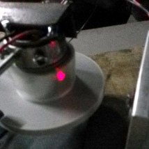

# ALProjector

This repo contains the implemented code and resources for building a DIY low cost Alphanumeric Laser Projector (ALP). The directories description is the following:

* *Firmware_Arduino:* Contains the Arduino main project file to control the step motor using the IR sensor feedback, the laser beam interrupt sequence to project the desired characters.
* *3D_model:* Contains the Sketchup and Collada 3D source files for printing the step motor drum / mirrors holder.
* *Software_GUI:* Contains the Java-based interface that opens the COM port communication with the Arduino board and sends the customised alphanumeric messages. Please note that this package is not up to date but I have included the source files for legacy purposes.

>

